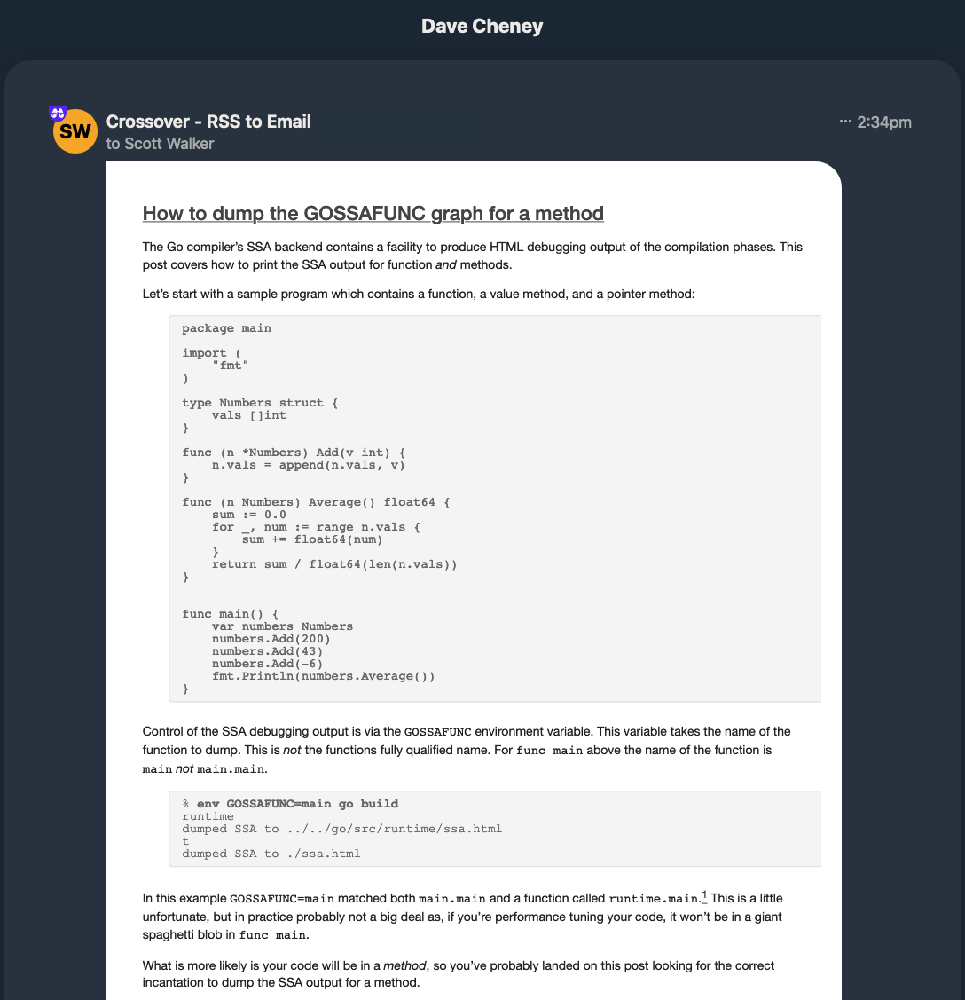

## RSS-to-email self-hosted using GitHub Actions

 [](https://goreportcard.com/report/github.com/scottyw/crossover)

Receive RSS updates by email via [SendGrid](https://sendgrid.com).

### Setup

**Step 0: Fork this repo**

**Step 1: Configure your SendGrid account**

You'll need a [SendGrid](https://sendgrid.com) account but the free tier will be enough.

You need to make sure you've configured your "[Single Sender Verification](https://app.sendgrid.com/settings/sender_auth)" in SendGrid. That confirms to them that you've access to the account you claim to be sending from. Their first time use workflow will walk you through it.

You also need to create an [API key](https://app.sendgrid.com/settings/api_keys).

**Step 2: Configure your GitHub secrets**

In your own repo, configure three secrets as follows:

| Secret name        | Value                                                                  |
| ------------------ | ---------------------------------------------------------------------- |
| `FROM_ADDRESS`     | The email address used in SendGrid during "Single Sender Verification" |
| `TO_ADDRESS`       | The address to send the email (can be the same as `FROM_ADDRESS`)      |
| `SENDGRID_API_KEY` | The SendGrid API key created above                                     |


**Step 3: Choose your feeds**

Edit `targets.json` and add feed URLs as keys with `null` as the corresponding values:

```json
{
    "https://dave.cheney.net/feed/atom": null,
    "https://fabiensanglard.net/rss.xml": null
}
```

Crossover will use this file to record the most recently seen item for each feed. After an update your targets file will look something like this:

```json
{
    "https://dave.cheney.net/feed/atom": "2020-06-19T03:39:34Z",
    "https://fabiensanglard.net/rss.xml": "2020-06-07T00:00:00Z"
}
```

**Step 4: Check update progress**

Feeds are checked for updates at 2am UTC and on every commit.

You can check progress in the "Actions" section of your repo.


### Examples


An email generated from Dave Cheney's RSS feed: https://dave.cheney.net


An email generated from Fabien Sanglard's RSS feed: https://fabiensanglard.net

### Caveats

Don't think of this as a quality product.

* There's no smart processing of feeds. I just assume they have dates, titles, links and contents/descriptions
* The HTML template is terrible. I cobbled it together with no skill and if you have insight on how to tweak it in an email-friendly manner I am interested!
* The error handling is laughable. You better hope nothing goes wrong or you'll enjoy an opaque immediate exit.

### Thanks

The actual work is done by [mmcdole's gofeed library](https://github.com/mmcdole/gofeed) and the SendGrid Go API bindings.
